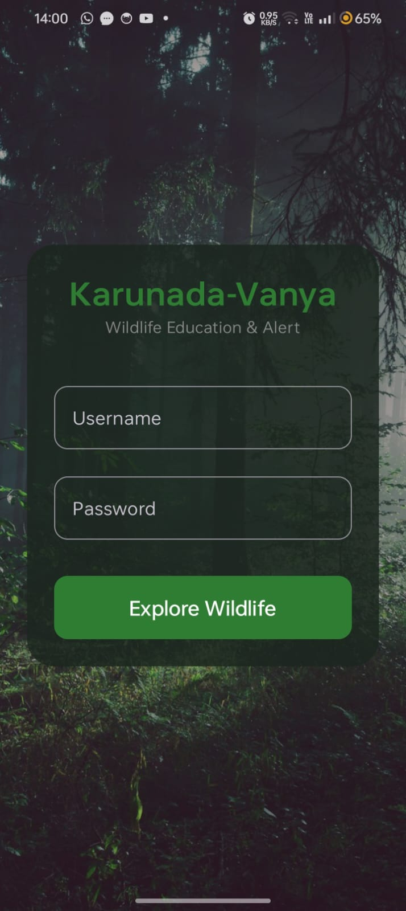
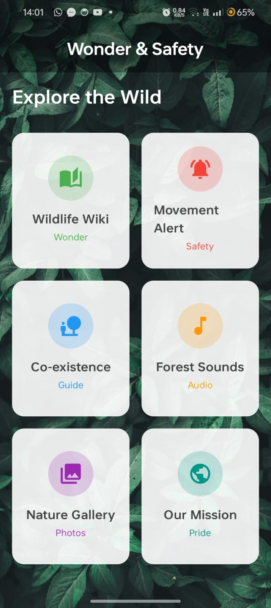
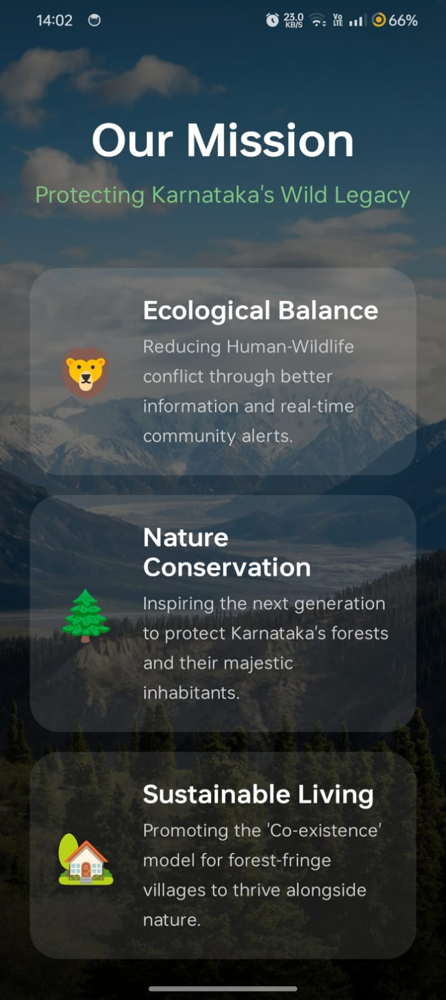

# Karunadu Vanya 🌿
### Wildlife Awareness & Forest Safety Android Application

## 📌 Problem Statement
Human–wildlife conflict and lack of forest safety awareness are growing concerns,
especially near forest regions. Visitors and locals often lack proper information
about wildlife behavior, safety precautions, and emergency actions.
Karunadu Vanya is designed to educate users and promote forest safety awareness
using a modern Android application.

## 🎯 Objectives
- Educate users about wildlife and forest environments
- Improve safety awareness
- Provide emergency guidance and safety tips
- Promote environmental responsibility

## 🚀 Features
- Wildlife information with descriptions
- Forest safety awareness module
- Emergency guidance and safety instructions
- Image gallery related to wildlife
- Modern UI using Jetpack Compose
- Multi-screen navigation

## 🛠 Technology Stack
- Kotlin
- Android Studio
- Jetpack Compose
- Gradle (Kotlin DSL)

## 📂 Project Structure
app/
├── data/model
├── ui/screens
├── ui/navigation
├── ui/theme
└── MainActivity.kt

## ▶️ How to Run
1. Clone the repository  
   `git clone https://github.com/Atikkhan675/karunadu-vanya-project.git`
2. Open in Android Studio
3. Let Gradle sync
4. Run on emulator or physical device

## 📸 Screenshots
### Login Screen

### Dashboard

### Forest Sound Awareness

### Movement Alert

### Wildlife Wiki

### Nature Gallery

### Our Mission

## 🔮 Future Enhancements
- GPS-based forest warning system
- Offline wildlife data
- Multi-language support

## 👨‍💻 Developer
Atik Khan  
Final-year engineering project
